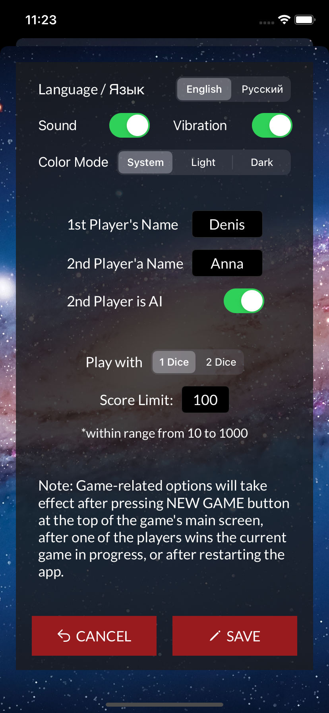

# DiceGame
Dice Game, also known as Pig Game

  
  
  

GAME RULES:
- The game has 2 players, playing in rounds. The first player to play the first round is determined randomly
- In each turn, a player rolls a dice as many times as he whishes. Each result get added to his ROUND score
- BUT, if the player rolls a 1, all his ROUND score gets lost. After that, it's the next player's turn
- A player looses his ENTIRE score when he rolls two 6 in a row. After that, it's the next player's turn.
- The player can choose to 'Hold', which means that his ROUND score gets added to his TOTAL score. After that, it's the next player's turn
- The first player to reach 100 (the number can be changed in the options) points in total - wins the game
